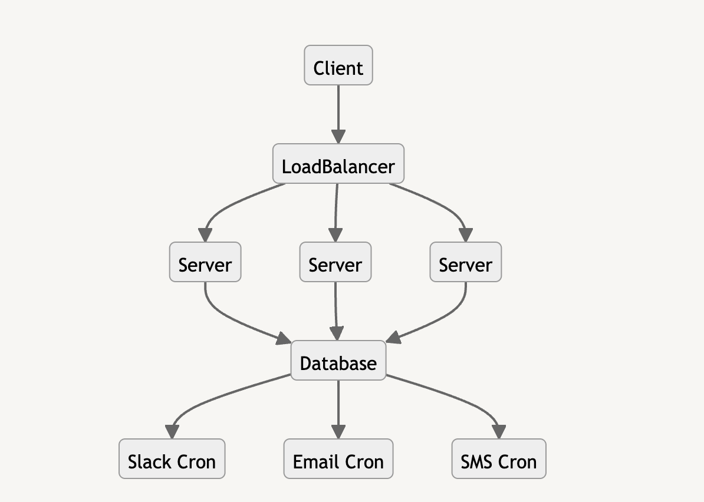

This is the second solution of the task.

## Architecture

The basic idea is that we have Client package, written in golang, which is used for calling the server(gRPC). Of course in production we need some kind of gRPC load balancer like Envoy or Linkerd, which will distribute HTTP/2 traffic and not let HTTP/2 streams reuse single TCP connection. The request is idempotent, meaning that we're handling deduplication on server side of the application. This is needed, because we're retrying client side requests and we need to make sure that single notification don't get sent twice. After that the application is working in async manner, meaning that the server is writing records in the DB and acknowledging the request. This is good in order to serve more traffic, because the heaviest portion of notification sending is the actual calling of library clients to serve to notification. After that we have cron jobs, which read the DB for records and do the actual sending of notifications. 

### Pros:
  - The system doesn't have a single point of failure.
  - High throughput due to the asynchronous nature of the system. The server's only job is to save a record in the db and acknowledge the request, which in theory should be a lot faster than doing all of the business logic inside the scope of the request handling.
  - Easy to scale.
  - No notifications lost and single point of data persistance.

### Cons:
  - Using DB as storage is actually an anti-pattern in this scenario, because of the cron jobs(consumers) having to constantly read from the DB. Some kind of throttling has to be implemented in order to minimize DB request, which in terms adds some delay for the actual notification sending logic to happen. As next step of the application development introduction of message queue such as Kafka is a must in order to optimize the flow.
  - Harder to set-up.
  - Need to prove with benchmark tests that this way the request handling is faster.

## How to start
  1. Run **make init**
  2. After you init please follow the same instruction for filling in the .env file from the main branch.
  3. Run **make prod** - be aware that this will start 5 containers, 2 of which are the actual server and the DB containers. This is important, because they are exposed on host machine ports - port 8000 for the server and port 5432 for the DB so make sure you have those 2 ports available.
  4. After this setup you can start using the client in cmd/playground/main.go. It has 3 methods, which call the gRPC server:
      - 
      - 
      - 

  5. Once you've populated you'r desired notification with data run **make run-client**, which will send your request to be processed.

## Further improvements
Most of the improvements were mentioned in the Architecture section, but there are still things, which can be improved.
1.  Add gRPC interceptors such as logging, tracing, panic handler etc.
2. Add tests, because currently there are none for this solution(I'm sorry, unfortunately I had no time.)
3. Add better client API -  expose different structs with client level validation for the different gRPC methods.

## Final words
Thank you for bearing with me, I had a lot of fun doing this task, hope everything works smooth during code review/testing the solution, if there is any kind of problem running the system please don't hesitate to contact me at kkereziev97@gmail.com. I'd be very happy if you try the solution yourself.