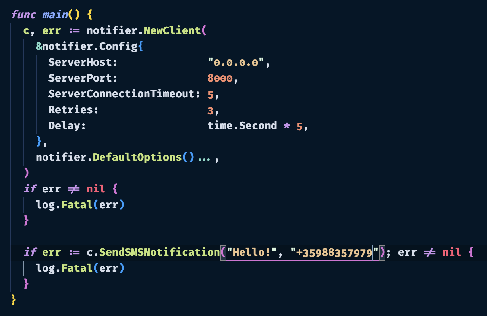

Hey folks, first of all I'd like to thank you for the opportunity and for the task, it was quite fun working on it.

## Important
There is a second solution I created in separate branch in this repo called v2, please after reviewing this one checkout and see the other solution, since it is meant to be the more robust of the two.

## Basic Description of the solution
What I've created is a simple HTTP server with 3 POST endpoints for sending notifications via Slack, SMS and Mail. The server is stateless(we want it to be horizontally scalable) and has 3 middlewares(request/response logging, panic handling and and pre-flight request handling). The solution itself is using 3rd party integration in order to send notifications - for Slack it need Slack WebHook(https://api.slack.com/messaging/webhooks), for SMS notification it uses Twilio(https://www.twilio.com/en-us) and for emails it uses SMTP protocol. I've dockerized the server and have docker-compose setup with 2 services - one is for local hot reloading of the server and the second one is optimized version of the server.

## API
As I mentioned I've created 3 endpoints:
* /api/v1/slack(**POST** method)
  - As a request body it expects only **message** of the notification
  - 
* /api/v1/mail(**POST** method)
  - As a request body it expects **message** of the notification, **send_to** email recipient of the notification and **subject** of the email.
  -
* /api/v1/sms(**POST** method)
  - As a request body it expects **message** of the notification and **send_to_number** phone number, which will receive the notification(the phone number must be in e164 format).
  - 

## How to start
I'm going to lay down a list of instruction on how to start the service and send requests.
  1. Execute **make init**, this will create .env file
  2. You need to provide configuration data in the .env file
      -   
      - For Slack you need to provide valid WebHook in **SLACK_WEB_HOOK_URL**
      - For SMS notifications you need to setup Twilio account, please watch this video - https://www.youtube.com/watch?v=-fqGGqXHQ2E&ab_channel=OutrightSystems, you need to provide SID and Token of your Twilio profile and Twilio generated number for sending SMS notifications.
      - For email notifications you need to provide sender email and SMTP configuration. As example I'll be using Gmail - EMAIL_SENDER - your gmail email, SMTP_HOST - smtp.gmail.com, SMTP_PORT-465, SMTP_USERNAME- your gmail email, SMTP_PASSWORD- your app generated password, for generating such password please check https://www.youtube.com/watch?v=1YXVdyVuFGA&ab_channel=Sombex
      - For the most part Slack is the easies one, if you just want to check endpoint I'd suggest putting some placeholder values for all env vars and providing valid Slack WebHook since its the easies and try sending Slack notification.

  3.Execute **make up s=service**, this will expose the server on local port 8000.

## Dev setup
1. Execute **make dev-dependencies** in order to get all dev dependencies.
2. Check other handy make commands in Makefile.

## Prod setup
 Since we don't really have any dependencies on the server like DB or Message Queue the architecture of the service is pretty straight forward. We will need to use some kind of Load Balancer since we expect the service to be horizontally scaled in order to manage and distribute traffic. With this in mind the design should look something like this:

The server is already containerized so we can make use of Kubernetes for better managing our app and abstracting machine level details. We can provide Kubernetes with some app constraints like cpu and memory utilization, min and max replicas of the server and leave Kubernetes to manage our solution. Since we're gonna need Kubernetes it's better to use it like a SaaS, which means that we need to use some kind of Cloud - GCP, AWS, Azure etc.

## Further improvements
1. The application needs SWAGGER generation for better usage ot it's API.
2. Add more unit tests to check middleware functions.
3. The application needs some kind of storage in order to better scale it and make it more fault tolerant - DB(Postgres,MySQL) or preferably some kind of Message Queue(RabbitMQ, Kafka). With storage in place we can the whole process asynchronous - accepting request, putting them in the storage and creating worker service to handle records in the storage. The problem with the current approach is that if the service crashes for some reason we will loose all requests.
4. Introduce **correlation_id** request header for tracing capabilities of the service.
5. Currently we have Retry function which guarantees "at least once" SLA - in case of error we will retry to send the notification. We can further improve this by investigating other 3rd party service if they have notion if idempotent operations - if this is the case we can introduce idempotency key together with ACID SQL DB in order to further guarantee "at least once".